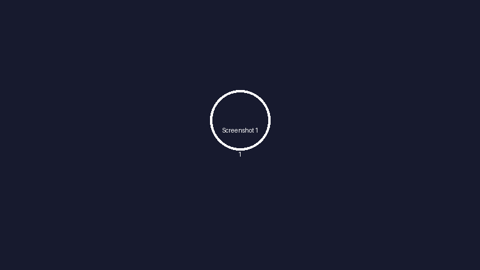
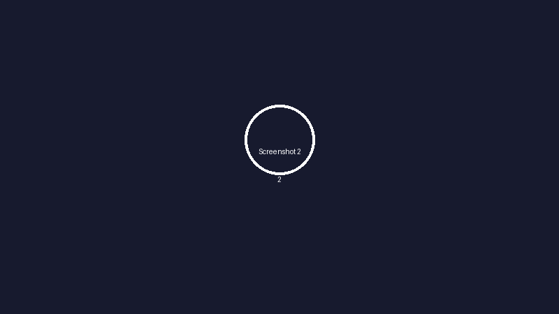

# myNotes

[](https://www.python.org/)
[](https://github.com/TomSchimansky/CustomTkinter)

Ένα desktop app για σημειώσεις γραμμένο σε Python με `customtkinter`.

## Screenshots





## Τι κάνει
- Διαχειρίζεται σημειώσεις με τίτλο, περιεχόμενο και ετικέτες (`tags`)
- Προσφέρει φιλική σκοτεινή διεπαφή με responsive διάταξη
- Ψάχνει σημειώσεις με live αναζήτηση
- Δημιουργεί, επεξεργάζεται και διαγράφει σημειώσεις
- Ομαδοποιεί σημειώσεις ανά ετικέτα
- Επιτρέπει επιλογή χρώματος για κάθε σημείωση

## Απαιτήσεις
- Python 3.11+ (ή 3.10+ με υποστήριξη τύπων)
- `customtkinter` 5.2.0 ή νεότερη

## Εγκατάσταση
```bash
pip install -r requirements.txt
```

## Εκτέλεση
```bash
python mynote.py
```

## Tests
```bash
pytest
```

## Δομή αρχείων
- `mynote.py`: κύριο αρχείο εκκίνησης της εφαρμογής
- `app.py`: κεντρική λογική και UI της εφαρμογής
- `widgets.py`: παράθυρο επεξεργασίας σημειώσεων και κάρτες σημειώσεων
- `config.py`: χρωματικό θέμα, χρωματικοί τόνοι και υποστήριξη ετικετών
- `data.py`: αρχείο φόρτωσης/αποθήκευσης δεδομένων
- `notes_data.json`: αποθηκευμένες σημειώσεις και ετικέτες

## Χρήση
1. Εκκίνηση της εφαρμογής
2. Πατήστε `+ New Note` για νέα σημείωση
3. Επιλέξτε ετικέτα και χρώμα
4. Χρησιμοποιήστε την αναζήτηση για να φιλτράρετε σημειώσεις
5. Πατήστε `Edit` ή `Del` σε κάθε κάρτα για επεξεργασία ή διαγραφή
6. Χρησιμοποιήστε τα κουμπιά `↑` και `↓` πάνω σε κάθε σημείωση για να αλλάξετε τη σειρά της

## Σημείωση
Η εφαρμογή χρησιμοποιεί το `customtkinter` για σύγχρονη εμφάνιση και λειτουργίες GUI στην Python.
