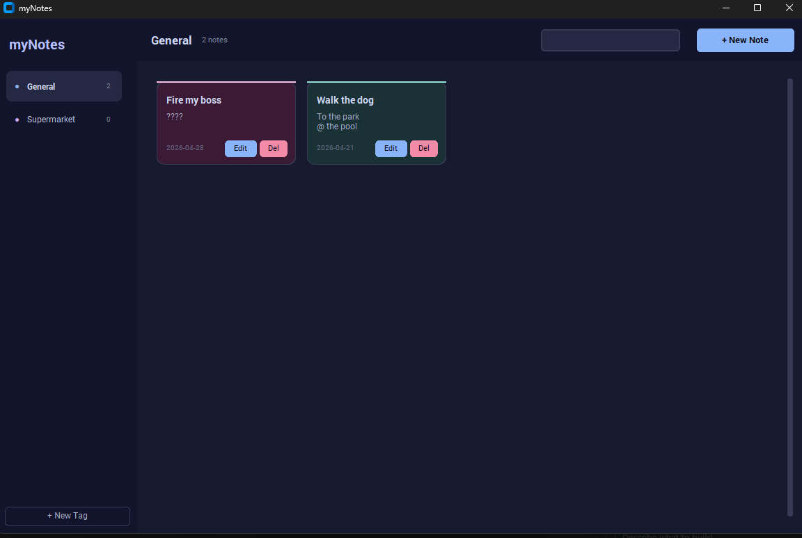
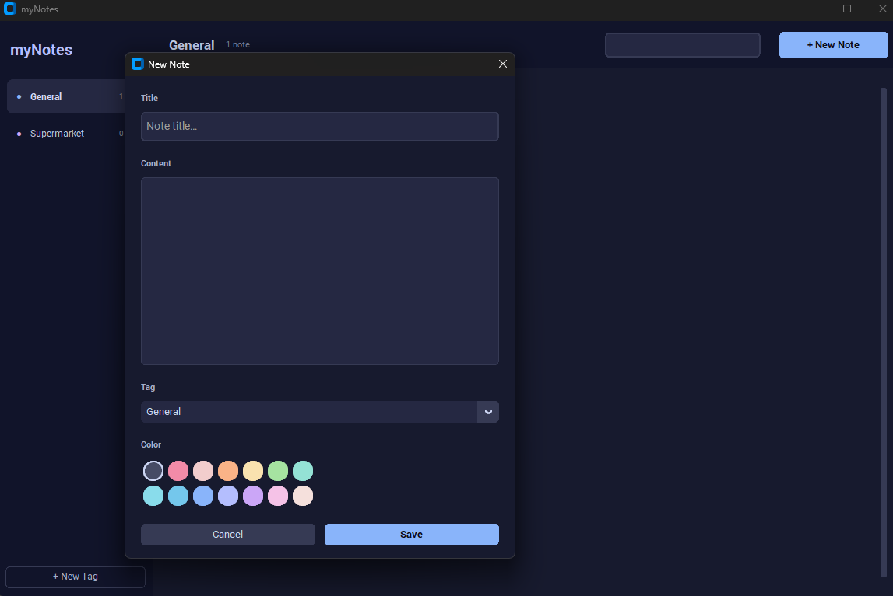

# myNotes

A desktop note-taking app built with Python and `customtkinter`.

## Download

**Windows** — no Python required:

[Download myNotes.exe](dist/myNotes.zip)

> The zip includes the standalone Windows app. Download, unzip, and run `myNotes.exe` — your notes are saved next to the exe.

## Screenshots





## Features
- Manage notes with title, content, tag and color
- Modern dark UI with responsive layout
- Live search across note titles and content
- Create, edit, delete, and reorder notes
- Group notes by tag and choose note colors

## Requirements
- Python 3.11+ (or Python 3.10+ with type support)
- `customtkinter` 5.2.0 or newer

## Install
```bash
pip install -r requirements.txt
```

## Run
```bash
python mynote.py
```

## Tests
```bash
python -m pytest -q
```

## Project structure
- `mynote.py`: application launcher
- `app.py`: main app logic and UI
- `widgets.py`: note editor and note card widgets
- `config.py`: theme colors, tag colors, and note colors
- `data.py`: load/save note data
- `note_utils.py`: helper functions and testable logic
- `notes_data.json`: saved notes and tags
- `tests/`: unit test suite
- `assets/screenshots/`: screenshot images

## Usage
1. Launch the app
2. Click `+ New Note` to add a note
3. Select a tag and color
4. Use search to filter notes
5. Use `Edit` or `Del` to update or remove a note
6. Use the `↑` and `↓` buttons on each note to change order

## Notes
The app uses `customtkinter` for a modern Python GUI.
